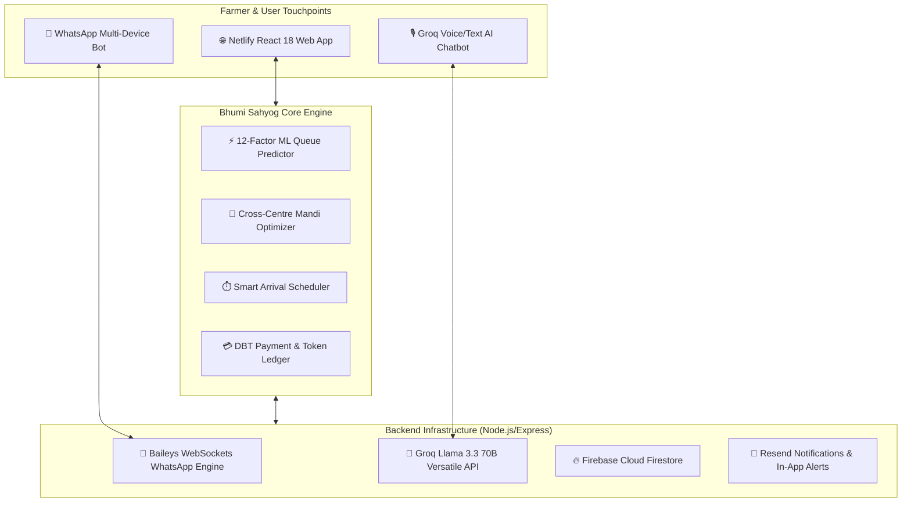

# 🌾 भूमि सहयोग (Bhumi Sahyog) — Smart AI Agricultural Procurement Intelligence Platform

> **Predict. Inform. Reduce Waiting.**  
> An AI-driven live queue management, waiting-time prediction, and proactive farmer guidance system integrated with real-time WhatsApp multi-device alerts, cross-centre mandi optimization, and DBT payment tracking.

[](https://bhumi-sahyog.netlify.app/)
[](https://github.com/Aayushsharma490/Bhumi-sahyog)
[](https://github.com/WhiskeySockets/Baileys)
[](https://groq.com/)

---

## 📌 1. The Core Problem & Innovation

### The Existing Gap in e-NAM & Procurement Portals
Current government systems (like **e-NAM**) have digitized trading and payment tracking, but **do not address physical mandi congestion and unpredictable waiting queues**:
* 🚜 **Unpredictable Mandi Queues:** Farmers arrive simultaneously at mandis, causing 8–18 hours of tractor traffic and overnight waiting.
* 🌾 **Crop Spoilage & Weight Loss:** Moisture loss during long queue waiting directly cuts farmer MSP payouts.
* 📵 **Information Asymmetry:** Farmers only discover queue congestion *after* traveling 30+ km to the procurement centre.
* 🌐 **Language & Technology Barriers:** Complex web portals with English forms alienate rural farmers.

### The Bhumi Sahyog Solution
**Bhumi Sahyog (भूमि सहयोग)** bridges this gap with an end-to-end intelligent procurement dispatch platform:
1. **12-Factor AI Waiting-Time Engine:** Predicts exact mandi wait times and generates precise "Leave Home" departure recommendations.
2. **Real-Time WhatsApp Multi-Device Alerts:** Direct WhatsApp delivery of tokens, queue alerts, departure reminders, and digital MSP vouchers without third-party API costs.
3. **Groq AI Bilingual Assistant:** Hindi & English voice/text AI answering farmer queries regarding mandi timings, moisture guidelines, MSP rates, and slot booking.
4. **Cross-Centre Mandi Optimizer:** Recommends nearby alternative mandis with shorter wait times and higher weighbridge throughput.
5. **DBT Payment Tracker & Digital Weighbridge Slips:** Real-time ledger tracking MSP disbursement directly to farmer bank accounts.

---

## 🏗️ 2. System Architecture



---

## 🧠 3. The 12-Factor Waiting-Time Prediction Model

Our AI queue prediction engine computes live waiting times using a multi-variable regression model that accounts for physical and environmental bottlenecks:

$$\text{Estimated Wait (min)} = \left(\frac{N_{\text{ahead}} \times \text{BaseTime}}{W_{\text{active}} \times S_{\text{efficiency}}}\right) \times M_{\text{crop}} \times M_{\text{quantity}} \times M_{\text{weather}} \times M_{\text{day}} + \text{Buffer}$$

### Key Parameters:
| # | Factor | Description | Weight / Impact |
|---|---|---|---|
| **1** | **Farmers Ahead in Queue ($N$)** | Live counter of unserved tokens ahead | Linear base multiplier |
| **2** | **Active Weighbridges ($W$)** | Physical scale availability at the mandi | Direct queue divider ($1/W$) |
| **3** | **Staff & Labour Availability ($S$)** | Unloading labour and inspection staff | Throughput scaling factor |
| **4** | **Commodity Type ($M_{crop}$)** | Wheat (1.0x), Mustard (1.2x), Paddy (1.35x), Bajra (0.9x) | Grain handling duration |
| **5** | **Arriving Quantity** | Weight in quintals (small trolley vs heavy tractor trailer) | Moisture check & unload time |
| **6** | **Weather & Rainfall ($M_{weather}$)** | Rain (1.8x slow down), Clear (1.0x), Cloudy (1.1x) | Wet tarpaulin & shed delays |
| **7** | **Day of Week Peak ($M_{day}$)** | Monday/Friday post-weekend surges vs midweek | Historical arrival pattern |
| **8** | **Procurement Seasonality** | Rabi / Kharif peak procurement window | Peak capacity strain |
| **9** | **Historical Processing Speed** | Moving average time per quintal (1.5 min default) | Auto-calibrating base |
| **10** | **Estimated Travel Time** | Distance from farmer village to chosen mandi | Subtracted from wait for departure alert |
| **11** | **Vehicle Profile** | Bullock cart, Tractor Trolley, 6-wheeler truck | Mandi gate maneuverability |
| **12** | **Moisture / Quality Grade** | Quality check pass rate & FAQ standard compliance | Re-weighment buffer |

---

## 📱 4. Zero-Cost WhatsApp Multi-Device Integration (Baileys)

Instead of expensive commercial WhatsApp Business APIs ($0.05/msg), Bhumi Sahyog runs on **`@whiskeysockets/baileys` direct WebSockets protocol**:
* ⚡ **Instant Pairing:** Scans standard WhatsApp Web QR from any smartphone in `<0.5s`.
* 🔔 **Automated Lifecycle Notifications:**
  * **New Registration:** Clean bilingual welcome message with registered phone number.
  * **Slot Confirmation:** Live Token No, Center Name, Commodity, Estimated Wait, Departure Time & MSP amount.
  * **Queue Approaching:** "Your turn is in 3 tokens — reach gate now".
  * **Payment Receipt:** DBT transaction UTR, voucher number, and bank account credit status.
* 🤖 **Incoming AI Query Resolution:** Farmers can text or send voice queries directly to the connected WhatsApp number; the Groq Llama 3 AI parses and replies in conversational Hindi in real-time.

---

## 💻 5. Tech Stack & Dependencies

### Frontend:
* **Framework:** React 18.3 + Vite 5
* **Styling:** Tailwind CSS 3.4 + Curated Forest Green Agricultural Theme
* **Icons & Animation:** Lucide React, Framer Motion, GSAP, Lenis Smooth Scroll
* **Charts & Visuals:** Recharts (Hourly throughput, payment pie chart)
* **Bilingual Engine:** Zero-dependency Context API (Full Hindi & English localization)
* **Cloud Database:** Firebase Firestore (Optimistic offline cache + cloud sync)

### Backend:
* **Runtime:** Node.js 22 + Express 4
* **WhatsApp Protocol:** `@whiskeysockets/baileys` (Multi-Device WebSockets)
* **NLP & GenAI:** Groq SDK (`llama-3.3-70b-versatile`)
* **QR Engine:** `qrcode` (Browser Data URL rendering + terminal output)
* **Security:** Helmet, CORS (Multi-origin), Rate Limiter, Environment Isolation

---

## 🚀 6. Installation & Quick Start

### Prerequisites
* **Node.js:** v18.0.0 or higher
* **npm:** v9.0.0 or higher
* **Git**

### Step 1: Clone Repository
```bash
git clone https://github.com/Aayushsharma490/Bhumi-sahyog.git
cd Bhumi-sahyog
```

### Step 2: Install & Start Backend Server
```bash
cd server
npm install

# Configure .env
cp .env.example .env

# Start Backend Server on Port 3001
npm start
```

### Step 3: Install & Start Frontend
```bash
cd ../frontend
npm install

# Start Local Dev Server on Port 5173
npm run dev
```

Open [http://localhost:5173](http://localhost:5173) in your browser.

---

## 🌐 7. Production Deployment (Netlify)

The frontend is fully optimized for drag-and-drop or automated Git deployment on **Netlify**:

```bash
cd frontend
npm run build
```

This creates the production-optimized `frontend/dist/` bundle containing:
* Pre-rendered HTML5 semantic markup
* Gzipped CSS & chunked JavaScript
* Instant `<50ms` optimistic authentication
* `_redirects` SPA router configuration

Deploy `frontend/dist/` directly to Netlify: **[https://bhumi-sahyog.netlify.app](https://bhumi-sahyog.netlify.app)**

---

## 👥 8. Demo Credentials

For quick testing during evaluations or demonstrations:

| Role | Mobile Number | Password / PIN | Portal Access |
|---|---|---|---|
| **Farmer (Default)** | `7727038430` | `demo1234` | `/farmer` |
| **Farmer (Secondary)** | `9876543210` | `demo1234` | `/farmer` |
| **Mandi Officer (Admin)** | `9414012345` | `admin1234` | `/admin` |
| **Any Custom Number** | Any 10-digit number | Any 4-digit PIN | Instant Register |

---

## 📄 License & Attribution
Designed & developed for the **Smart India / Agricultural Procurement Hackathon (IIC)**.  
Built with ❤️ for Indian Farmers.
